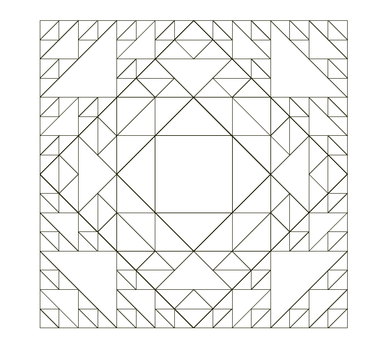

## Exécution : 
Ouvrir un terminal dans le répertoire du TP et lancer la commande :

```bash
./run.sh
```

### Visualisation
Dans le fichier run.sh, il est possible de modifier quel automate est utiliser pour construire la fractale, et le nombre d'itérations

### Exemples 
 


